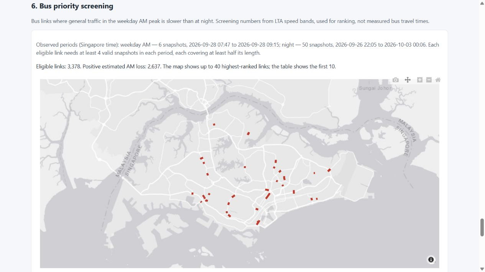

# Reliability review — 3 October 2026

Reviewed base: `243403c15be1738bcb9f9cacb2bac7960b32003e`.

## Reproduced problems and fixes

| Trigger | Previous result | Corrected behavior |
|---|---|---|
| One of two equal-length speed segments is missing | 25 km/h plus missing became 12.5 km/h; all missing became zero | Missing/invalid speed contributes neither speed nor weight; all invalid stays missing |
| A 1 km link has only a 100 m segment observed in each of four peak snapshots | Static geometry coverage allowed a ranking at 3.6 estimated bus-hours/h | Require at least 50% valid observed length in each snapshot before counting it |
| A link has only one valid snapshot while the whole collection has four | The global sample count passed | Every link independently needs four covered snapshots per period |
| A new run lacks enough observations | It returned before writing, leaving the old CSV | Write a header-only CSV and new observation metadata; smoke uses a separate stem |
| July classifies a stop as normal, but the median baseline flags it | Deduplication retained July's normal row, then discarded the stop | Filter each baseline before deduplication; retain the label's `flag_baseline` |
| A planted bug fails during import or test collection | Any pytest error counted as a detected bug | Require a clean full-suite baseline, compile/import each variant, and count only actual test failures |

## Real-data refresh

The original local database was opened read-only. Only review-worktree outputs were written. Its SHA256 remained `ad332a078f8544539ebeaf90c586fa26283a41ef9a14af9fb1e8e4d5f476a38a` before and after both refreshes. The original untracked priority CSV was not read or overwritten.

| Output | Before | After |
|---|---:|---:|
| Stops in OD evidence (union of both flag baselines) | 74 | 88 |
| Stop × destination rows | 191 | 231 |
| Median-flagged stops with OD evidence | 57 of 71 | 71 of 71 |
| Eligible priority links on the identical input window | 3,378 | 3,378 |

Restored OD stops: `14121`, `15221`, `16031`, `16039`, `16109`, `27461`, `40501`, `43551`, `50241`, `65449`, `67339`, `75069`, `81181`, `94009`.

The 71 anomaly categories are unchanged: 27 academic-term, 12 near-campus academic-term, 7 school-term, 4 sustained steps, 3 services withdrawn, 2 direction-unclear changes, 2 services added, and 14 unexplained. An OD change provides evidence about trip destinations; it does not verify the cause of a surveillance flag.

The priority refresh considered 209 archived snapshot files up to **2026-10-03 00:06 SGT**, using the existing September network and segment geometries. The selected windows contain six AM snapshots on 28 September and 50 night snapshots. Of 7,579 candidate links no longer than 2 km, 6,056 match road-speed geometry and 3,378 meet the observation requirements; 2,637 have positive estimated AM loss. The new edge-case guards do not remove links from this particular real-data window. Their failures were demonstrated with controlled fixtures.

Input file hashes and the result hash are in [`priority_review_inputs.json`](../outputs/priority_review_inputs.json). The dashboard uses [`priority_screen_metadata.json`](../outputs/priority_screen_metadata.json), and displays its dates only if the CSV hash matches.

## Verification and reproduction

- Full local test suite: **94 passed**. Regression tests invoke the production functions, including actual spatial matching, temporary DuckDB OD data, the anomaly evidence builder, stale-result replacement, smoke isolation and dashboard result states.
- The full mutation suite caught **28 of 28 variants**, with zero escapes. It first passed the full 94-test baseline, validated unique replacement targets and valid syntax/imports, and counted only actual test failures. All 12 Python source files were independently verified byte-for-byte restored. CI runs it with the full test suite.
- Rebuilt the static dashboard from the refreshed outputs and checked the live local page at desktop and phone widths: section navigation, 10 ranking rows, observation dates, restored OD text, map rendering and contained horizontal tables.
- Existing corridor, demand and walking-coverage outputs were retained; those expensive raw-data pipelines were not rerun as part of this review. This is local/browser/CI verification, not a production deployment or a bus-operation intervention.

With the raw files already present, rebuild the affected outputs in a working copy:

```bash
python src/od.py
python src/anomalies.py
python src/priority.py
python src/dashboard.py
python -m pytest -q tests
python tests/mutate.py
```

The commands use all eligible snapshots in that copy. To reproduce the recorded window exactly, use the archived files identified in `priority_review_inputs.json` and exclude later snapshot files. `src/od.py` rebuilds the OD database tables; the review itself queried the existing database read-only and did not modify it.

The priority score uses general-traffic band midpoints and scheduled bus frequencies. It does not measure bus journey time, waiting time or passenger delay. The current peak period is one morning; more representative observations remain necessary before treating the ranking as a transport decision.


